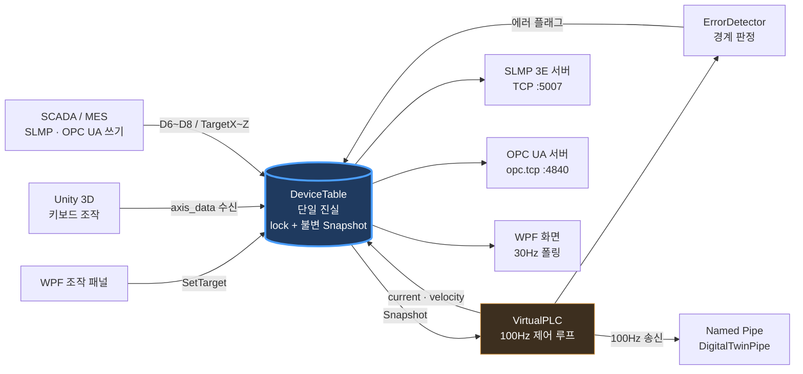
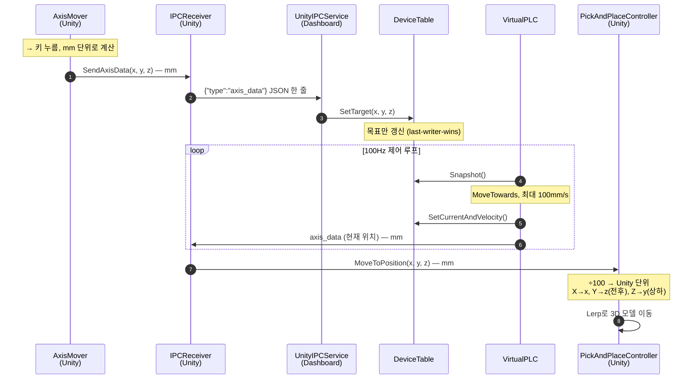

# DigitalTwin.Dashboard

[](https://github.com/udune/DigitalTwin.Dashboard/actions/workflows/ci.yml)

픽앤플레이스 장비의 Soft-PLC 겸 감시 대시보드입니다. 가상 PLC 루프가 3축 위치와 속도를 산출해 `DeviceTable` 한 곳에 적어두고, 그 값을 SLMP 3E와 OPC UA, Named Pipe 세 갈래로 동시에 내보냅니다.

PLC 하드웨어 없이도 상위 시스템(SCADA, MES, HMI, 3D 트윈)이 붙어서 통신을 검증해볼 수 있게 만드는 게 목표였습니다. 3D 뷰어는 [DigitalTwin_PickAndPlace](https://github.com/udune/DigitalTwin_PickAndPlace) 저장소에 따로 있고, 이 저장소는 그 뷰어가 붙는 두뇌 쪽입니다.

## 전체 구조

```
                          ┌──────────────────────────┐
   Unity 3D ──Named Pipe──┤                          ├──→ SLMP 3E Server   :5007
                          │       DeviceTable        │     (미쓰비시 호환 D/M 디바이스)
   VirtualPLC ──~64Hz*───→┤    (single source of     │
                          │         truth)           ├──→ OPC UA Server    :4840
   ErrorDetector ←────────┤   불변 Snapshot pull     │     (opc.tcp, 19 노드)
                          │                          │
                          └────────────┬─────────────┘
                                       │ 30Hz 폴링
                                       ▼
                                   WPF UI (MVVM)
```

\* 제어 루프의 목표 주기는 100Hz인데 Windows 타이머 해상도(~15.6ms)에 눌려 실제로는 ~64Hz로 돕니다. 뒤에 따로 적었습니다.



## 상태는 한 곳에만 둔다

만들면서 제일 신경 쓴 규칙입니다. 모든 상태는 `DeviceTable` 하나에만 있고, UI든 Unity 송신이든 SLMP든 OPC UA든 자기 상태를 따로 들지 않습니다. 필요할 때 `Snapshot()`으로 한 시점을 통째로 복사해 갑니다. 반환값이 불변 `record struct`라서 소비하는 쪽에서 필드 티어링(일부 필드만 갱신된 어정쩡한 상태를 읽는 문제)이 생기지 않습니다.

`DeviceTable`에는 변경 통지 이벤트가 없습니다. 제어 루프 주기로 이벤트를 뿌리면 구독자 수만큼 초당 수백 건이 UI 스레드로 쏟아지기 때문에, 필요한 쪽이 각자 원하는 주기로 당겨가는 방식을 택했습니다. 덕분에 제어 루프와 UI 갱신(30Hz)이 완전히 따로 놉니다.

SLMP·OPC UA 서버는 `DeviceTable`만 참조하는 어댑터로 나중에 얹은 것입니다. 기존 제어 로직은 한 줄도 고치지 않았고, 서버를 통째로 들어내도 나머지는 그대로 돕니다.

락은 단일 `lock` 하나입니다. 크리티컬 섹션이 필드 복사뿐이라 마이크로초 단위로 끝나서, `ReaderWriterLockSlim`까지 갈 이유를 찾지 못했습니다.

## 가상 PLC와 100Hz의 진실

루프 주기 100Hz는 목표치이지 보장치가 아닙니다. Windows 기본 타이머 해상도가 약 15.6ms라 `Task.Delay(10)`이 실제로는 ~15.5ms 걸리고, 루프는 100Hz가 아니라 약 64Hz로 돕니다(개발 환경 실측 64.5Hz, 평균 주기 15.51ms).

여기서 한 번 크게 데였습니다. 이동량과 속도를 가정한 주기(1/100초)로 계산하고 있었더니, 명령 속도 100mm/s가 실제로는 ~64mm/s로 움직이는데 화면에는 100으로 표시됐습니다. 1.55배 부풀림이었고 사이클 타임 통계도 같이 틀어져 있었습니다. 지금은 `Stopwatch`로 잰 실제 경과 시간으로 계산합니다. 루프가 한참 멈췄다 재개할 때 축이 순간이동하지 않도록 경과 시간에는 100ms 상한을 뒀습니다.

이동은 `MoveTowards` 등속 보간이고 최대 속도는 `MaxSpeed`(기본 100mm/s)입니다. 축이 물리적으로 갈 수 있는 범위(travel clamp)와 알람을 울릴 경계는 별개로 관리합니다.

## 오류 감지

제어 루프가 위치를 기록한 직후, 매 회차 UI 스레드 밖에서 판정합니다. 같은 오류는 기본 30초 간격으로만 다시 기록되고 이 간격은 UI 슬라이더로 조정할 수 있습니다.

| 오류 | 조건 | 레벨 | 코드 |
|---|---|---|---|
| X축 리미트 초과 | X < XMin 또는 X > XMax | Error | `X_LIMIT` |
| Y축 리미트 초과 | Y < YMin 또는 Y > YMax | Error | `Y_LIMIT` |
| Z축 범위 초과 | Z < ZMin 또는 Z > ZMax | Error | `Z_LIMIT` |
| 안전 높이 미달 | Z < -30mm 이면서 XY 이동 중 | Warning | `Z_SAFE_HEIGHT` |
| 축 과속 | \|V\| > `AlarmMaxVelocity` (기본 150mm/s) | Warning | `*_OVERSPEED` |
| 과속 설정 불일치 | `AlarmMaxVelocity` ≥ `MaxSpeed` (시작 시 1회) | Warning | `CONFIG_OVERSPEED_UNREACHABLE` |

경계값은 `appsettings.json`에 빼뒀고, 돌아가는 중에 SLMP나 OPC UA로도 바꿀 수 있습니다.

마지막 줄이 좀 웃긴 사연입니다. 속도는 `MoveTowards`가 자르고 남은 실제 이동 거리에서 역산하기 때문에 \|V\|는 절대 `MaxSpeed`를 넘지 못합니다. 그런데 기본 설정이 `MaxSpeed` 100에 `AlarmMaxVelocity` 150이었습니다. 과속 경보가 구조적으로 울릴 수 없는 상태로 한참을 돌고 있었던 겁니다. 지금은 시작할 때 이 조합을 확인해서 `CONFIG_OVERSPEED_UNREACHABLE` 경고를 한 번 올립니다. 조용히 죽어 있느니 시끄럽게 알려주는 편이 낫다고 봤습니다. 과속 경보를 실제로 쓰려면 `AlarmMaxVelocity`를 `MaxSpeed` 아래로 내리거나 `MaxSpeed`를 임계 위로 올리면 됩니다.

## 오류 판정은 여기서만 한다

한동안 같은 오류가 화면에 두 줄로 떴습니다. Dashboard도 "축이 범위를 벗어났나"를 판정하고 Unity도 따로 판정하고 있었는데, 기준도 다르고(이쪽은 mm, 저쪽은 Unity unit) 오류에 붙이는 이름표도 달랐던 탓입니다.

지금은 경계 판정을 `ErrorDetector` 한 곳에서만 합니다. Unity의 `ErrorConditionMonitor`는 파이프가 연결되면 자기 판정을 멈추고 표시만 하는 역할로 물러납니다.

판정이 한쪽에만 있다는 건 "조건이 풀렸다"는 사실도 이쪽만 안다는 뜻입니다. 그래서 `ErrorDetector`는 매 회차 성립한 조건 집합을 들고 있다가 직전에 있던 조건이 사라지면 `OnErrorCleared(code)`를 올리고, 그걸 `error_clear`로 Unity에 보냅니다. 이 채널이 없던 시절에는 축이 정상 범위로 돌아와도 뷰어의 오류 표시가 `clear_all_errors`를 누를 때까지 그대로 남아 있었습니다.

해제됐던 조건이 다시 성립하면 새로운 사건이므로 30초 억제창을 기다리지 않고 즉시 다시 알립니다. 다만 대시보드의 알람 목록은 이력이라 해제돼도 지우지 않습니다. 발생했다는 사실과 횟수는 남습니다.

## 화면

3축 현재 위치와 속도를 0.1mm 단위로 보여주고, LiveCharts로 위치 추이를 그립니다. 같은 알람은 `×N`으로 묶어 발생 시간 범위와 함께 표시하고, 이력은 CSV로 내보낼 수 있습니다(`exports/`, RFC 4180 이스케이프 처리).

사이클은 Z축이 하한과 상한을 차례로 통과하는 걸 보고 자동으로 셉니다. 평균 사이클 타임도 같이 나옵니다. 수동 조작은 0.1 / 0.5 / 1.0mm 스텝과 직접 입력을 지원하고, 원점 복귀와 PLC·Unity 연결 상태 표시가 있습니다.

## SLMP 3E (TCP 5007)

미쓰비시 SLMP 3E 프레임을 직접 파싱하고 응답합니다. 실수값은 ×10 스케일 `short`로 인코딩합니다(12.3mm → 123).

| 디바이스 | 내용 | 접근 |
|---|---|---|
| D0 ~ D2 | 현재 위치 X / Y / Z | R |
| D3 ~ D5 | 현재 속도 X / Y / Z | R |
| D6 ~ D8 | 타겟 위치 X / Y / Z | R/W |
| D10 ~ D11 | X축 알람 경계 Min / Max | R/W |
| D12 ~ D13 | Y축 알람 경계 Min / Max | R/W |
| D14 ~ D15 | Z축 알람 경계 Min / Max | R/W |
| M100 | 에러 램프 (통합) | R |
| M101 ~ M103 | X / Y / Z 축 에러 플래그 | R |

지원하는 명령은 이렇습니다.

| 명령 | 서브 | 동작 | 지원 |
|---|---|---|---|
| `0x0401` | `0x0000` | Word Read | D 디바이스 |
| `0x1401` | `0x0000` | Word Write | D6~D8, D10~D15 만 |
| `0x0401` | `0x0001` | Bit Read | M 디바이스 |
| `0x1401` | `0x0001` | Bit Write | 미지원 (`0xC059` 반환) |

Bit Write를 뺀 건 게을러서가 아니라 쓸 비트가 없어서입니다. 이 맵의 M 디바이스(M100~M103)는 전부 `ErrorDetector`의 판정 결과, 그러니까 읽기 전용 출력 플래그입니다. 위 디바이스 표의 M 항목이 전부 `R`인 것과 같은 얘기고, 그래서 프레임은 정상적으로 인식하되 `0xC059`로 거부합니다. `SlmpTestClient` 5번 시나리오가 이 거부 동작을 확인합니다.

| 엔드 코드 | 의미 |
|---|---|
| `0x0000` | 정상 |
| `0xC059` | 미지원 명령 / 미지원 디바이스 / 읽기 전용 영역 쓰기 / 맵 밖 주소 |
| `0xC051` | 요청 점 수 범위 초과 (최대 960워드) |

TCP는 프레임이 쪼개져 도착하는 게 정상이므로 부분 수신 재조립도 구현했습니다.

## OPC UA (opc.tcp://localhost:4840)

OPC Foundation .NET Standard 스택을 쓰고, `CustomNodeManager2`를 상속해 주소 공간을 직접 짰습니다. `PickPlace` 폴더 아래 19개 변수를 약 30Hz로 갱신합니다.

| 노드 | 타입 | 접근 |
|---|---|---|
| `CurrentX` / `CurrentY` / `CurrentZ` | Double | R |
| `VelocityX` / `VelocityY` / `VelocityZ` | Double | R |
| `TargetX` / `TargetY` / `TargetZ` | Double | R/W |
| `XMin` / `XMax` / `YMin` / `YMax` / `ZMin` / `ZMax` | Double | R/W |
| `ErrorLamp` / `XError` / `YError` / `ZError` | Boolean | R |

Application URI는 `urn:DigitalTwin:PickPlace:Server`이고, UaExpert 같은 표준 클라이언트로 브라우징됩니다.

## Named Pipe (`DigitalTwinPipe`)

Unity 뷰어와 주고받는 줄 단위 JSON 채널입니다.

| 방향 | 타입 | 내용 |
|---|---|---|
| → Unity | `axis_data` | 위치·속도·타임스탬프 (제어 루프 매 회차, 실측 ~64Hz) |
| → Unity | `error` | 알람 발생 (code, source, errorType, message) |
| → Unity | `error_clear` | 조건이 해소된 오류 1건 해제 (code) |
| → Unity | `clear_all_errors` | 알람 일괄 해제 |
| ← Unity | `axis_data` | 키보드 조작 결과를 타겟으로 반영 (last-writer-wins) |

오류의 식별자는 `code`(`X_LIMIT`, `Z_SAFE_HEIGHT`, `X_OVERSPEED` 등)입니다. Unity가 이 값을 그대로 오류 Id로 쓰고, `error_clear`가 같은 코드를 지목해 그 오류 하나만 거둡니다. `code`가 없거나 `source`/`errorType`이 모르는 값이면 Unity는 경고 로그만 남기고 버립니다. 예전에는 모르는 값을 기본값으로 삼켰는데, 그러다 축이 아닌 `SYSTEM` 알람이 X축 오류로 둔갑해 카메라가 엉뚱한 데를 비추는 일이 있었습니다.

파이프는 반드시 양방향(`PipeDirection.InOut`)으로 열어야 합니다. 한쪽 방향으로 열면 연결 자체가 깨집니다.



## 빌드와 실행

Windows와 .NET 10 SDK가 필요합니다.

```bash
git clone https://github.com/udune/DigitalTwin.Dashboard.git
cd DigitalTwin.Dashboard
dotnet run
```

앱이 뜨면 SLMP(기본 5007)와 OPC UA(기본 4840)는 바로 리슨을 시작합니다. 포트는 `appsettings.json`에서 바꿉니다. 다만 가상 PLC 제어 루프와 Named Pipe 서버는 `START`를 눌러야 돕니다.

기동 자체는 `MainWindow`가 `MainViewModel.Initialize()`를 한 번 부르는 것으로 일어납니다. 뷰모델 생성자는 배선만 하고 파일도 소켓도 건드리지 않으므로, 테스트에서 뷰모델을 만들어도 포트가 잡히지 않습니다.

| 버튼 | 동작 |
|---|---|
| `START` | PLC 루프 + Unity IPC 시작 |
| `STOP` | PLC 루프 정지 |
| `원점 복귀` | 타겟을 (0,0,0)으로 설정, 도달하면 완료 표시 |
| `알람 클리어` | 알람 목록 초기화 + Unity에 해제 통보 |
| `알람 내보내기` | `exports/` 에 CSV 저장 |

## 테스트

```bash
dotnet test DigitalTwin.Dashboard.slnx
```

94개가 자동으로 돕니다. 앱을 띄우거나 버튼을 누를 필요는 없습니다.

| 파일 | 대상 | 다루는 내용 |
|---|---|---|
| `Slmp/SlmpProtocolTests.cs` | SLMP 프레임 해석기 | 정상 요청(워드/비트 읽기·쓰기), 쪼개져 온 데이터, 맵 밖·읽기 전용 주소, 잘못된 명령·디바이스 코드, 점 수 범위 |
| `Slmp/WordConversionTests.cs` | float ↔ 워드 변환 | ×10 스케일, 반올림, `short` 범위를 넘는 값의 클램프(래핑 방지) |
| `ErrorDetectorTests.cs` | 오류 감지기 | 경계선 안/밖, 축별 플래그, 안전 높이, 과속, 같은 경보 반복 억제, 조건이 풀렸을 때 해제 통보 |
| `MotionTests.cs` | 위치 계산 | 오버슈트 금지, 설정 주입, 루프가 명령한 속도로 도는지 |
| `DeviceConfigTests.cs` | 설정 로드 | 파일 없음·깨진 JSON·빈 JSON에서 기본값 유지, 포트 반영, 실제 `appsettings.json` 파싱 |
| `MainViewModelTests.cs` | 뷰모델 생성 | 생성만으로는 서버 포트를 잡지 않는지, 설정 경고가 상태줄에 뜨는지 |

SLMP 테스트는 서버를 빈 포트에 띄우고 실제 TCP로 말을 겁니다. 파서만 리플렉션으로 끄집어내 부르는 것보다, 프레임 파싱부터 응답 빌드와 부분 수신 재조립까지 와이어 그대로 확인하는 편이 믿을 만하다고 봤습니다. 서비스와 모델이 전부 `internal`이라 테스트 어셈블리에만 `InternalsVisibleTo`로 문을 열어줬습니다.

`main`으로 가는 push와 PR마다 GitHub Actions가 restore, build, test를 Release로 돌립니다(`.github/workflows/ci.yml`). WPF가 끼어 있어 러너는 `windows-latest`입니다.

## 밖에서 찔러보는 검증

자동 테스트와 별개로, 실행 중인 앱에 밖에서 붙어보는 콘솔 클라이언트를 두 개 뒀습니다. 자동 테스트가 프로세스 안에서 서버 로직을 보는 거라면 이쪽은 진짜 앱 프로세스를 상대로 하는 종단 확인입니다.

```bash
# WPF 앱을 먼저 실행하고 START를 누른 뒤
dotnet run --project SlmpTestClient
dotnet run --project OpcUaTestClient
```

SLMP 쪽 시나리오는 여섯 개입니다.

1. `D0~D2` Word Read로 현재 위치 확인
2. `D6~D8`에 Write 후 `D0~D2` 재독해 — 타겟이 반영되는지
3. `M100` Bit Read
4. `D11`(XMax)을 현재 X 아래로 Write → `M100` ON 확인 (경계를 런타임에 좁혀 알람 유발)
5. 읽기 전용(`D0`), 맵 밖(`D9`), Bit Write(`M100`) → 전부 `0xC059`가 오고 상태는 그대로인지
6. 쪼개진 프레임을 부분 수신해도 정상 파싱되는지

2번과 4번은 축이 실제로 움직여야 판정되므로 START를 안 누르면 실패합니다. `SlmpServer`는 앱을 켜자마자 리슨하지만 `VirtualPLC` 루프와 `ErrorDetector` 평가는 START 이후에만 돕니다.

## 설정

`appsettings.json`이고 빌드하면 출력 디렉터리로 복사됩니다.

```json
{
  "XLimit": 500.0,      // 물리적 이동 한계 (travel clamp)
  "YLimit": 500.0,
  "ZMin": -100.0,
  "ZMax": 50.0,
  "AlarmXMin": -125.9,  // 알람 경계 (런타임 변경 가능)
  "AlarmXMax": 125.9,
  "AlarmYMin": -125.9,
  "AlarmYMax": 125.9,
  "AlarmZMin": -60.0,
  "AlarmZMax": 0.0,
  "MaxSpeed": 100.0,          // 보간 최대 속도 (mm/s) — |V|의 상한
  "AlarmMaxVelocity": 150.0,  // 과속 경보 임계 (mm/s) — MaxSpeed 이상이면 도달 불가
  "SlmpPort": 5007,           // SLMP 3E 서버 리슨 포트
  "OpcUaPort": 4840           // OPC UA 서버 리슨 포트
}
```

읽기는 `DeviceConfig.Load()`가 맡습니다. 파일이 없으면 조용히 기본값을 쓰고, 있는데 못 읽으면 기본값으로 뜬 뒤 상태줄에 사유를 남깁니다. 설정 하나 때문에 앱이 못 뜨는 일은 없습니다.

물리적 한계와 알람 경계는 다른 겁니다. 앞은 축이 실제로 갈 수 있는 범위(클램프)고, 뒤는 그 안에서 경보를 울릴 기준선입니다.

`MaxSpeed`와 `AlarmMaxVelocity`도 같은 관계입니다. 앞이 속도의 천장을 만들고 뒤가 그 아래 어딘가에 그어지는 선이라, 뒤를 앞보다 높이 두면 경보는 울릴 수가 없습니다(위에 적은 그 사연입니다). `MaxSpeed`가 0 이하로 들어오면 축이 멈춰버리므로 기본값 100으로 되돌립니다.

## 구조

```
DigitalTwin.Dashboard/
├── Models/
│   ├── AxisData.cs          축 위치·속도 DTO
│   ├── AlarmData.cs         알람 (그룹화 정보 포함)
│   ├── DeviceConfig.cs      appsettings 바인딩 + 로드(Load)
│   └── SystemStatus.cs      시스템 가동 상태
├── Services/
│   ├── DeviceTable.cs       단일 진실 + 불변 스냅샷
│   ├── VirtualPLC.cs        제어 루프 (목표 100Hz, 실측 경과 시간 기반)
│   ├── ErrorDetector.cs     경계 판정 및 알람 생성
│   ├── SlmpServer.cs        SLMP 3E 프레임 서버
│   ├── OpcUaServer.cs       OPC UA 서버 + 노드 매니저
│   └── UnityIPCService.cs   Named Pipe 서버
├── ViewModels/
│   └── MainViewModel.cs     커맨드 + 옵저버블 상태
├── DigitalTwin.Dashboard.Tests/
│   ├── Slmp/                프레임 해석기 · 워드 변환 테스트
│   ├── ErrorDetectorTests.cs
│   ├── MotionTests.cs
│   ├── DeviceConfigTests.cs
│   └── MainViewModelTests.cs
├── SlmpTestClient/          실행 중인 앱 대상 프로토콜 검증 콘솔
├── OpcUaTestClient/
├── .github/workflows/       CI 워크플로
└── appsettings.json
```

네 프로젝트 모두 `DigitalTwin.Dashboard.slnx`에 등록돼 있어서 솔루션 빌드 한 번이면 전부 컴파일됩니다.

## 아직 안 된 것들

- 그리퍼 Pick/Place는 Unity 키보드로만 됩니다. 명령 채널은 Unity에 이미 있는데 대시보드 쪽 송신 UI가 아직 없습니다.
- OPC UA는 익명 접속만 됩니다. 인증서나 서명·암호화 같은 보안 정책은 붙이지 않았습니다.
- 가상 PLC는 등속 이동 모델이라 가감속 프로파일이 없습니다.
- 제어 루프는 목표 100Hz에 못 미치고 실제로는 ~64Hz입니다. Windows 타이머 해상도 한계이고 이동량·속도는 실측 시간으로 보정하니 정확도 문제는 없지만, 샘플링 밀도는 목표의 3분의 2쯤입니다. 진짜 100Hz가 필요하면 타이머 해상도를 올리는 별도 조치를 해야 합니다.
- 기본 설정(`MaxSpeed` 100 / `AlarmMaxVelocity` 150)에서는 과속 경보가 울리지 않습니다. 시작할 때 경고로 알려주긴 하지만, 쓰려면 두 값을 손봐야 합니다.
- 자동 테스트는 `Services`·`Models`와 `MainViewModel` 생성 시점까지입니다. `Initialize()` 이후의 커맨드·타이머 동작과 UI, `UnityIPCService`, `OpcUaServer`는 아직 눈으로 확인하고 있습니다. 상태 갱신이 `Application.Current.Dispatcher`를 직접 부르는 탓에 커맨드는 WPF 앱 없이는 부를 수 없습니다.

## 로드맵

- [ ] `UnityIPCService` 재연결 시나리오 자동 테스트 (지금은 육안 확인)
- [ ] 대시보드 Pick/Place 제어 UI
- [ ] 실제 미쓰비시 PLC 연동 (SLMP 클라이언트 모드)
- [ ] OPC UA 보안 정책 및 사용자 인증
- [ ] 알람·트렌드 이력 DB 적재
- [ ] 구조화 로깅 (Serilog)

## 연관 리포지토리

[DigitalTwin_PickAndPlace](https://github.com/udune/DigitalTwin_PickAndPlace) — Unity 3D 시각화 클라이언트 (Unity 6, URP, Cinemachine 3.1, UI Toolkit)
